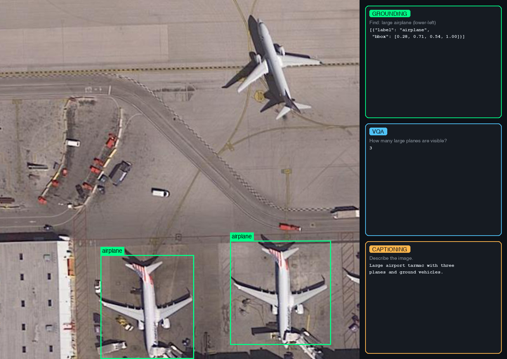
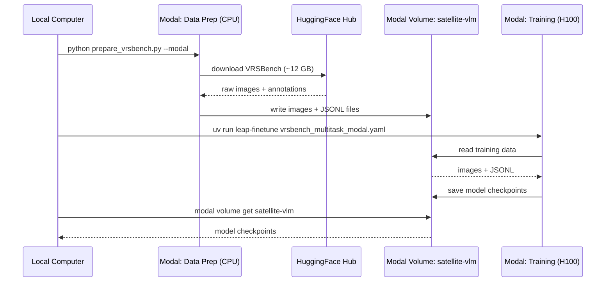

# Fine-Tune a Vision-Language Model on Satellite Imagery

Fine-tune [LiquidAI/LFM2.5-VL-450M](https://huggingface.co/LiquidAI/LFM2.5-VL-450M) on satellite imagery tasks using

- [leap-finetune](https://github.com/Liquid4All/leap-finetune/): Liquid AI's fine-tuning framework for LFM models.
- [Modal](https://modal.com): serverless GPU cloud for running data prep and training without managing infrastructure.
- [VRSBench](https://huggingface.co/datasets/xiang709/VRSBench) dataset (NeurIPS 2024) which supports three tasks:
    - **VQA**: answer questions about satellite images (123K QA pairs)
    - **Visual Grounding**: detect and localize objects with bounding boxes (52K references)
    - **Captioning**: generate detailed descriptions of satellite scenes (29K captions)



## Quickstart

1. **Install and authenticate** (run from `cookbook/examples/satellite-vlm/`): [Modal](https://modal.com) provides serverless GPUs you pay for per second. New accounts include $30 of free credit, enough to run this example end to end. No local GPU required.

    ```bash
    uv sync
    uv run python -m modal setup
    uv run huggingface-cli login
    ```

2. **Prepare data** (~12 GB): the download and conversion run inside a Modal container, and the resulting data is pushed to a Modal volume where the fine-tuning job will pick it up.

    ```bash
    uv run python prepare_vrsbench.py --task all --modal
    ```

3. **Clone leap-finetune and kick off fine-tuning** on an H100, checkpoints saved to the `satellite-vlm` Modal volume:

    ```bash
    git clone https://github.com/Liquid4All/leap-finetune/
    cd leap-finetune
    uv sync
    uv run leap-finetune ../configs/vrsbench_multitask_modal.yaml
    ```


## How It Works

All heavy computation runs in the cloud. The only things that run locally are the `prepare_vrsbench.py` launcher and the `leap-finetune` CLI, both of which just submit jobs and stream logs.

1. **Data prep (Modal CPU container):** `prepare_vrsbench.py --modal` spins up a Modal container, downloads VRSBench (~12 GB) from HuggingFace, converts it to JSONL, and writes everything to a Modal volume named `satellite-vlm`.
2. **Training (Modal H100):** `leap-finetune` submits a training job that reads data from the same volume, fine-tunes the model, and saves checkpoints back to the volume.
3. **Retrieval (local):** you pull the checkpoints from the volume to your local machine with `modal volume get`.



## Data Preparation

`prepare_vrsbench.py` downloads VRSBench from HuggingFace and converts it to the JSONL format required by leap-finetune.

**Modal (recommended):** runs entirely in the cloud, writes directly to the `satellite-vlm` Modal volume:

    uv run python prepare_vrsbench.py --task all --modal

**Local (for development):** single task or limited sample count for quick iteration:

    uv run python prepare_vrsbench.py --task vqa --limit 500

Output files (written to `./data/` locally, or to the Modal volume with `--modal`):
- `vrsbench_{task}_train.jsonl`: training data
- `vrsbench_{task}_eval.jsonl`: evaluation data


## Training

Run from the `leap-finetune` root (cloned in the Quickstart):

    uv run leap-finetune ../configs/vrsbench_multitask_modal.yaml

The job runs on an H100, streams logs to your terminal, and saves checkpoints to the `satellite-vlm` Modal volume under `/satellite-vlm/outputs/`.

To enable experiment tracking, uncomment `tracker: "wandb"` in the config.


## Retrieving Checkpoints

List and download checkpoints from the Modal volume:

    modal volume ls satellite-vlm outputs/
    modal volume get satellite-vlm /satellite-vlm/outputs/<run-name> ./outputs


## Data Format

The grounding task uses JSON bounding box format with 0-1 normalized coordinates, matching the LFM VLM's pretraining format:

    User:      Inspect the image and detect the large white ship.
               Provide result as a valid JSON:
               [{"label": str, "bbox": [x1,y1,x2,y2]}, ...].
               Coordinates must be normalized to 0-1.

    Assistant: [{"label": "ship", "bbox": [0.37, 0.00, 0.80, 0.99]}]

VQA and captioning use standard question-answer format with no special structure.


## Evaluation

Benchmarks run automatically during training at every `eval_steps`:

- **VQA**: `short_answer` metric (case-insensitive substring match)
- **Grounding**: `grounding_iou` metric (IoU@0.5 threshold)
- **Captioning**: `CIDEr` or `BLEU` metrics

Each eval dataset can be limited (e.g., 500 samples) via the `limit` field in the YAML config for faster iteration.

**Running a full standalone evaluation:** to evaluate on the complete dataset without retraining, use `configs/vrsbench_full_eval.yaml`. Set `eval_on_start: true`, remove the `limit` fields, and point the config at your checkpoint path. The model runs the full evaluation at step 0, logs results to WandB, and terminates.
